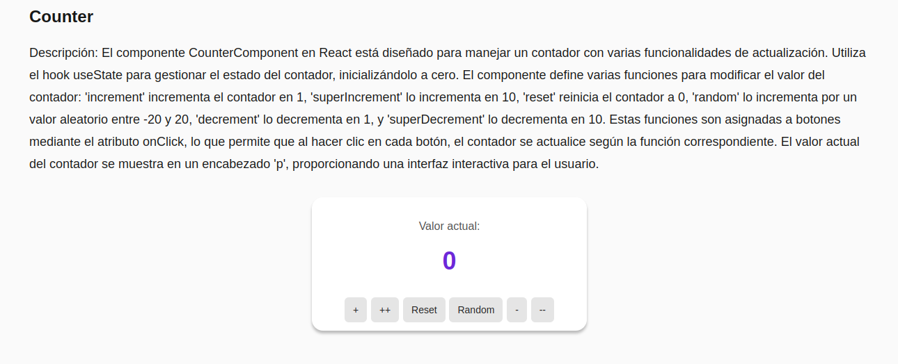

# 🌟 Proyecto Vite - App de Ejemplos Interactivos

Este proyecto desarrollado con [Vite](https://vitejs.dev/) incluye tres secciones principales: un contador interactivo, un filtro de Pokémon, y un carrito de compras funcional. Desarrollado por un equipo de tres integrantes, esta aplicación web te permite explorar distintas funcionalidades interactivas con un diseño limpio y fácil de usar.

---

## 📋 Instalación

1. **Clona el repositorio**:
   ```bash
   git clone https://github.com/tu_usuario/nombre_del_proyecto.git

   cd nombre_del_proyecto
npm install
npm run dev
## 🚀 Funcionalidades del Proyecto

<div style="background-color: black; color: white; padding: 20px; border-radius: 8px;">

### 1. 🧮 Contador Interactivo
   El contador permite:
   - **Agregar** valores de 10 en 10.
   - **Restar** valores.
   - **Generar valores aleatorios**.
   - **Reiniciar** el contador.

   

   🎥 Demo Video del Contador:

---

### 2. 🔍 Filtro de Pokémon
   Filtra los Pokémon según su tipo, mostrando solo aquellos que coincidan con el filtro seleccionado.

   

   🎥 Demo Video del Filtro de Pokémon:

---

### 3. 🛒 Carrito de Compras
   Esta sección permite:
   - **Agregar** productos al carrito.
   - **Multiplicar automáticamente** la cantidad y el precio.
   - **Mostrar el total** a pagar en tiempo real.

   

   🎥 Demo Video del Carrito de Compras:

</div>

---

## 📸 Ejemplos Visuales
Puedes incluir capturas de pantalla y videos en las tres secciones. Aquí algunos ejemplos para que puedas personalizar:
- Para agregar una imagen:  
  ```markdown
  


