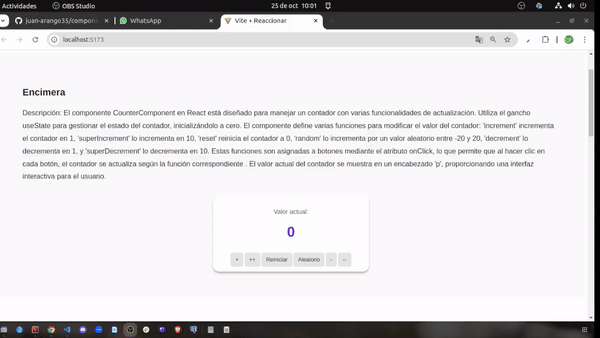
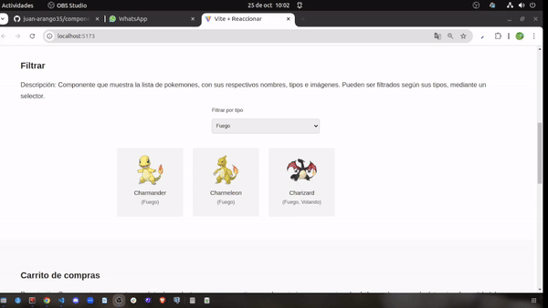
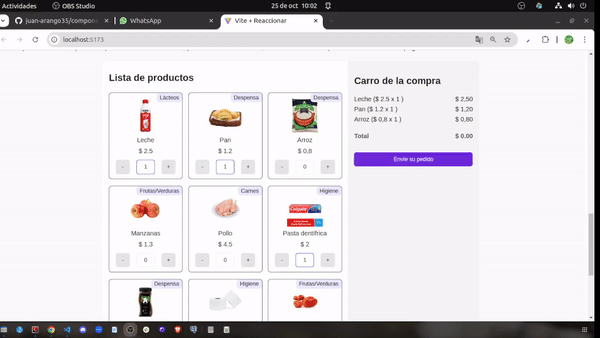

# 🌟 Proyecto Vite - React - Components

Este proyecto, desarrollado con Vite, incluye tres secciones principales: un contador interactivo, un filtro de Pokémon y un carrito de compras funcional. Desarrollado por un equipo de tres integrantes, agradezco inmensamente el trabajo realizado en equipo, lo cual fue una agradable experiencia trabajar con compañeros que aportan a tu aprendizaje. Esta aplicación web te permite explorar distintas funcionalidades interactivas con un diseño limpio y fácil de usar.

---

## 📋 Instalación

1. **Clona el repositorio**:
   ```bash
   git@github.com:juan-arango35/componenentes-react.git

   cd nombre_del_proyecto
npm install
npm run dev
## 🚀 Funcionalidades del Proyecto

<div style="background-color: black; color: white; padding: 20px; border-radius: 8px;">

### 1. 🧮 Contador Interactivo
   El contador permite:
   - **Agregar** valores de 10 en 10.
   - **Agregar** valores de 1 en 1.
   - **Resta** valores de 10 en 10.
   - **Resta** valores de 1 en 1.
   - **Generar valores aleatorios**.
   - **Reiniciar** el contador.

   

   🎥 Demo Video del Contador: <br/> 
---


### 2. 🔍 Filtro de Pokémon
   Filtra los Pokémon según su tipo, mostrando solo aquellos que coincidan con el filtro seleccionado.

   🎥 Demo Video del Filtro de Pokémon:

---
   

   
### 3. 🛒 Carrito de Compras
   Esta sección permite:
   - **Agregar** productos al carrito.
   - **Multiplicar automáticamente** la cantidad y el precio.
   - **Mostrar el total** a pagar en tiempo real.

  

  
</div>
 🎥 Demo Video del Carrito de Compras:
    


---
#DEMO:
[Demo de la Aplicación](https://componente-react.netlify.app/)


